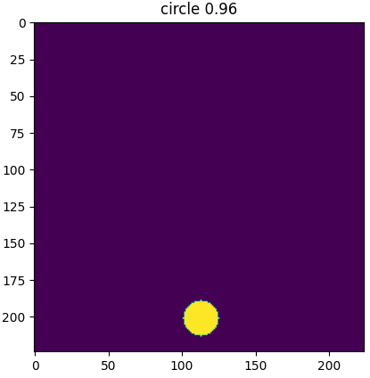
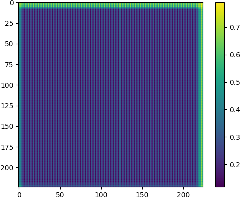

# Analyze pooling layers

This code allows **analyzing** the **effect** of the **pooling layers** in a **CNN**.
It implements a simple CNN model trained to distinguish between filled rectangles (class 0) and circles (class 1).
The model takes a 224x224 image as input and outputs a value between 0 and 1.



Pooling layers cause the model to be shift variant: 
shifting the input image by 1px causes the output to be different, even though CNNs are often said to be shift invariant.


## Getting started

Analyze the effect of the single pooling layer in the pre-trained network:
* Go to the folder `src/`
* Then, execute ```python main.py --mode analyze --num_pooling_layers 1```.

This command shifts an input shape (rectangle, class 0) to be classified all around the input image and then records the prediction (should be close to 0 because of predicting class 0) for all the tested image locations. The output should look as follows:



As can be seen, depending on the position of the shape in the input image the output slightly differs. This shows that CNNs with pooling layers are not shift invariant.


## Usage
General usage:
```python main.py --mode {train,infer,analyze} --num_pooling_layers {0,1,2}```.

Parameters:
* mode: first, train the model, then, you can either infer a few samples or analyze the effect of the pooling layers
* num_pooling_layers: number of pooling layers in the model, either 0, 1 or 2

Example to train the model:
```python main.py --mode train --num_pooling_layers 1```.

Example to infer a few samples with the trained the model:
```python main.py --mode infer --num_pooling_layers 1```.


## More information
This ARTICLE discusses the effect and shows suggestions on how to reduce it.